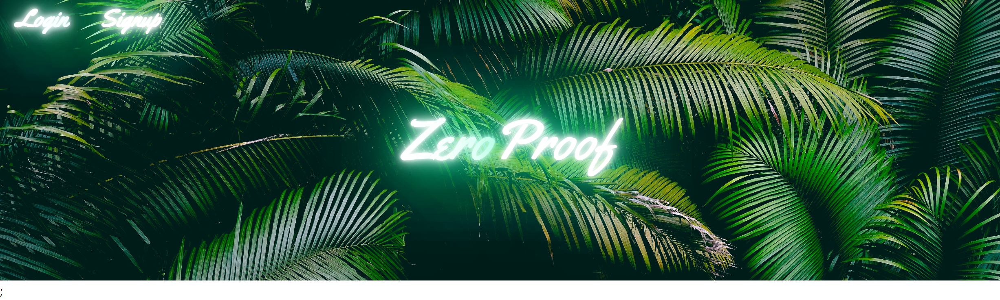
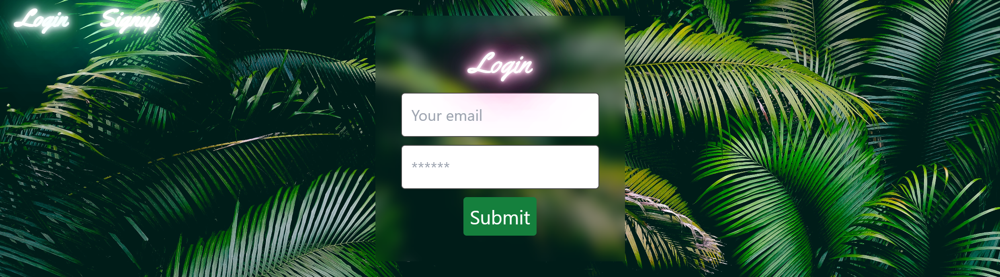
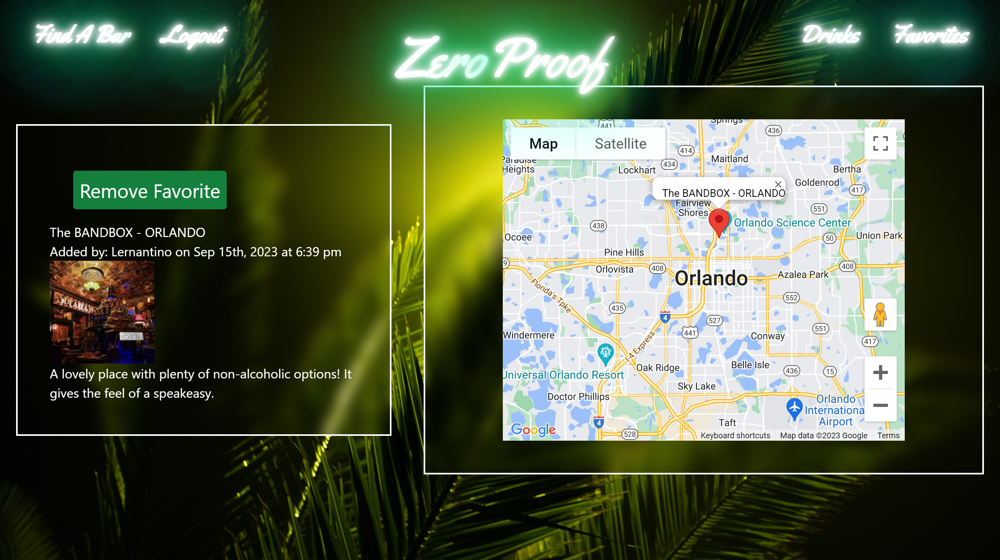

# Zero_Proof   

  ## Description

Zero-Proof is a vibrant community-driven app where non-alcoholic enthusiasts & sober individuals can unite to share their favorite mocktail recipes, review the latest non-alcoholic beers & spirits, & discover nearby non-alcoholic bars & lounges.

  ## Table of Contents

  1. [Installation](#installation)
  2. [Usage](#usage)
  3. [Credits](#credits)
  3. [License](#license)
  4. [Contributing](#contributing)
  5. [Tests](#tests)
  6. [Questions](#questions)

  ## Installation 

  N/A

  ## Usage 

  To use Zero Proof, first, log in or sign up using an email and password by clicking on one of the buttons in the top left corner. Once logged in, users can click on the new navigation buttons in the top of the page to get to the various pages within the site.
  
  The Find A Bar button will take the user to a page with a search bar and a map. Here users can search for locations that they know of, or use the map to click on the already added locations. For locations that have not already been added, users can add a description for the place and add it to the map. For places already on the map, users can add them to their favorites list.

  The Drinks button will take the user to a page where users can post thoughts on various different drinks. Users can also comment on other users thoughts for discussion.

  The Favorites button will take the user to a page with a map, where a user's favorited locations will appear, and instructions to click on a map marker to see more details for it.

  The user may also click the Logout button in order to sign out of their account.

  To visit the website click here: [Zero Proof](https://guarded-river-60488-2757545d4c45.herokuapp.com/)

  Screenshots:

  
  
  
  

  ## Credits 

Created by Courtney Sienkiewich, Katie Baldwin, Daniel Van Kirk, and Yan Perez

Credit to [Google Maps API](https://developers.google.com/maps/) for all map functions and visuals

  ## License 

  Licensed under [MIT](LICENSE)

  ## Contributing 

  To contribute, fork the project into your GitHub account and create a pull request for any helpful changes.

  ## Tests 

  N/A

  ## Questions 

  Reach out to us on GitHub!

  ### Github Links 
  * Courtney Sienkiewich: [SienkC](https://github.com/SienkC)
  * Katie Baldwin: [kateleighb3](https://github.com/kateleighb3)
  * Daniel Van Kirk: [Neatartist](https://github.com/Neatartist)
  * Yan Perez: [yanalejandro](https://github.com/yanalejandro)